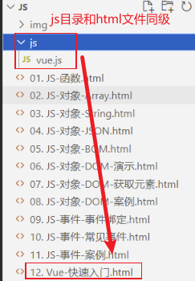
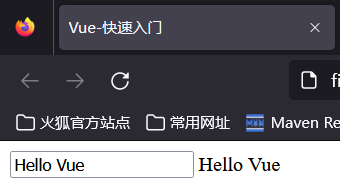

# 2 Vue

## 2.1 Vue概述

通过我们学习的html+css+js已经能够开发美观的页面了，但是开发的效率还有待提高，那么如何提高呢？我们先来分析下页面的组成。一个完整的html页面包括了视图和数据，数据是通过请求 从后台获取的，那么意味着我们需要将后台获取到的数据呈现到页面上，很明显， 这就需要我们使用DOM操作。正因为这种开发流程，所以我们引入了一种叫做**MVVM(Model-View-ViewModel)的前端开发思想**，即让我们开发者更加关注数据，而非数据绑定到视图这种机械化的操作。那么具体什么是MVVM思想呢？

MVVM:其实是Model-View-ViewModel的缩写，有3个单词，具体释义如下：

- Model: 数据模型，特指前端中通过请求从后台获取的数据
- View: 视图，用于展示数据的页面，可以理解成我们的html+css搭建的页面，但是没有数据
- ViewModel: 数据绑定到视图，负责将数据（Model）通过JavaScript的DOM技术，将数据展示到视图（View）上

如图所示就是MVVM开发思想的含义：

 

基于上述的MVVM思想，其中的Model我们可以通过Ajax来发起请求从后台获取;对于View部分，我们将来会学习一款ElementUI框架来替代HTML+CSS来更加方便的搭建View;而今天我们要学习的就是侧重于ViewModel部分开发的vue前端框架，用来替代JavaScript的DOM操作，让数据展示到视图的代码开发变得更加的简单。可以简单到什么程度呢？可以参考下图对比：

 

在更加复杂的dom操作中，vue只会变得更加的简单！在上述的代码中，我们看不到之前的DOM操作，因为vue全部帮我们封装好了。

接下来我们来介绍一下vue。

Vue.js（读音 /vjuː/, 类似于 **view**） 是一套构建用户界面的 **渐进式框架**。与其他重量级框架不同的是，Vue 采用自底向上增量开发的设计。Vue 的核心库只关注视图层，并且非常容易学习，非常容易与其它库或已有项目整合。Vue.js 的目标是通过尽可能简单的 API 实现**响应的数据绑定**和**组合的视图组件**。

框架即是一个半成品软件，是一套可重用的、通用的、软件基础代码模型。基于框架进行开发，更加快捷、更加高效。

## 2.2 快速入门

接下来我们通过一个vue的快速入门案例，来体验一下vue。

第一步：在VS Code中创建名为12. Vue-快速入门.html的文件，并且在html文件同级创建js目录，将**资料/vue.js文件**目录下得vue.js拷贝到js目录，如下图所示：

 

第二步：然后编写&lt;script&gt;标签来引入vue.js文件，代码如下：

~~~html

~~~

第三步：在js代码区域定义vue对象,代码如下：

~~~html

~~~

在创建vue对象时，有几个常用的属性：

- el:  用来指定哪儿些标签受 Vue 管理。 该属性取值 `#app` 中的 `app` 需要是受管理的标签的id属性值
- data: 用来定义数据模型
- methods: 用来定义函数。这个我们在后面就会用到

第四步：在html区域编写视图，其中{{}}是插值表达式，用来将vue对象中定义的model展示到页面上的

~~~html
<body>
    

        <input type="text" v-model="message">
        {{message}}
    

</body>
~~~

浏览器打开效果如图所示：

 

整体代码如下：

~~~html
<!DOCTYPE html>
<html lang="en">
<head>
    <meta charset="UTF-8">
    <meta http-equiv="X-UA-Compatible" content="IE=edge">
    <meta name="viewport" content="width=device-width, initial-scale=1.0">
    <title>Vue-快速入门</title>
    
</head>
<body>

    

        <input type="text" v-model="message">
        {{message}}
    

</body>

</html>
~~~

## 2.3 Vue指令

在上述的快速入门中，我们发现了html中输入了一个没有学过的属性`v-model`，这个就是vue的**指令**。

**指令：**HTML 标签上带有 v- 前缀的特殊属性，不同指令具有不同含义。例如：v-if，v-for…

在vue中，通过大量的指令来实现数据绑定到视图的，所以接下来我们需要学习vue的常用指令，如下表所示：

| **指令**  | **作用**                                            |
| --------- | --------------------------------------------------- |
| v-bind    | 为HTML标签绑定属性值，如设置  href , css样式等      |
| v-model   | 在表单元素上创建双向数据绑定                        |
| v-on      | 为HTML标签绑定事件                                  |
| v-if      | 条件性的渲染某元素，判定为true时渲染,否则不渲染     |
| v-else    |                                                     |
| v-else-if |                                                     |
| v-show    | 根据条件展示某元素，区别在于切换的是display属性的值 |
| v-for     | 列表渲染，遍历容器的元素或者对象的属性              |

### 2.3.1 v-bind和v-model

我们首先来学习v-bind指令和v-model指令。

| **指令** | **作用**                                       |
| -------- | ---------------------------------------------- |
| v-bind   | 为HTML标签绑定属性值，如设置  href , css样式等 |
| v-model  | 在表单元素上创建双向数据绑定                   |

- v-bind:  为HTML标签绑定属性值，如设置  href , css样式等。当vue对象中的数据模型发生变化时，标签的属性值会随之发生变化。

  接下来我们通过代码来演示。

  首先我们在VS Code中创建名为13. Vue-指令-v-bind和v-model.html的文件，然后准备好如下代码：

  ~~~html
  <!DOCTYPE html>
  <html lang="en">
  <head>
      <meta charset="UTF-8">
      <meta http-equiv="X-UA-Compatible" content="IE=edge">
      <meta name="viewport" content="width=device-width, initial-scale=1.0">
      <title>Vue-指令-v-bind</title>
      
  </head>
  <body>
      

  
          <a >链接1</a>
          <a >链接2</a>
  
          <input type="text" >
  
      

  </body>
  
  </html>
  ~~~

  在上述的代码中，我们需要给&lt;a&gt;标签的href属性赋值，并且值应该来自于vue对象的数据模型中的url变量。所以编写如下代码：

  ~~~html
  <a v-bind:href="url">链接1</a>
  ~~~

  在上述的代码中，v-bind指令是可以省略的，但是:不能省略，所以第二个超链接的代码编写如下：

  ~~~html
  <a :href="url">链接2</a>
  ~~~

  浏览器打开，2个超链接都可以点击，然后跳转到百度去！效果如图所示：

   

  

  **注意：html属性前面有:表示采用的vue的属性绑定！**

- v-model： 在表单元素上创建双向数据绑定。什么是双向？

  -  vue对象的data属性中的数据变化，视图展示会一起变化
  - 视图数据发生变化，vue对象的data属性中的数据也会随着变化。

  data属性中数据变化，我们知道可以通过赋值来改变，但是视图数据为什么会发生变化呢？**只有表单项标签！所以双向绑定一定是使用在表单项标签上的**。编写如下代码：

  ~~~html
  <input type="text" v-model="url">
  ~~~

  打开浏览器，我们修改表单项标签，发现vue对象data中的数据也发生了变化，如下图所示：

   

  通过上图我们发现，我们只是改变了表单数据，那么我们之前超链接的绑定的数据值也发生了变化，为什么？

  就是因为我们双向绑定，在视图发生变化时，同时vue的data中的数据模型也会随着变化。那么这个在企业开发的应用场景是什么？

  **双向绑定的作用：可以获取表单的数据的值，然后提交给服务器**

  

  整体代码如下:

  ~~~html
  <!DOCTYPE html>
  <html lang="en">
  <head>
      <meta charset="UTF-8">
      <meta http-equiv="X-UA-Compatible" content="IE=edge">
      <meta name="viewport" content="width=device-width, initial-scale=1.0">
      <title>Vue-指令-v-bind</title>
      
  </head>
  <body>
      

  
          <a v-bind:href="url">链接1</a>
          <a :href="url">链接2</a>
  
          <input type="text" v-model="url">
  
      

  </body>
  
  </html>
  ~~~

  

### 2.3.2 v-on

接下来我们学习一下v-on指令。

v-on: 用来给html标签绑定事件的。**需要注意的是如下2点**：

- v-on语法给标签的事件绑定的函数，必须是vue对象种声明的函数

- v-on语法绑定事件时，事件名相比较js中的事件名，没有on

  例如：在js中，事件绑定demo函数

  ~~~html
  <input onclick="demo()">
  ~~~

  vue中，事件绑定demo函数

  ~~~html
  <input v-on:click="demo()">
  ~~~

接下来我们通过代码演示。

首先在VS Code中创建名为14. Vue-指令-v-on.html的文件，提前准备如下代码：

~~~html
<!DOCTYPE html>
<html lang="en">
<head>
    <meta charset="UTF-8">
    <meta http-equiv="X-UA-Compatible" content="IE=edge">
    <meta name="viewport" content="width=device-width, initial-scale=1.0">
    <title>Vue-指令-v-on</title>
    
</head>
<body>
    

        <input type="button" value="点我一下">
        <input type="button" value="点我一下">

    

</body>

</html>
~~~

然后我们需要在vue对象的methods属性中定义事件绑定时需要的handle()函数，代码如下：

~~~js
 methods: {
        handle: function(){
           alert("你点我了一下...");
        }
}
~~~

然后我们给第一个按钮，通过v-on指令绑定单击事件，代码如下：

~~~html
 <input type="button" value="点我一下" v-on:click="handle()">
~~~

同样，v-on也存在简写方式，即v-on: 可以替换成@，所以第二个按钮绑定单击事件的代码如下：

~~~html
<input type="button" value="点我一下" @click="handle()">
~~~

完整代码如下：

~~~html
<!DOCTYPE html>
<html lang="en">
<head>
    <meta charset="UTF-8">
    <meta http-equiv="X-UA-Compatible" content="IE=edge">
    <meta name="viewport" content="width=device-width, initial-scale=1.0">
    <title>Vue-指令-v-on</title>
    
</head>
<body>
    

        <input type="button" value="点我一下" v-on:click="handle()">

        <input type="button" value="点我一下" @click="handle()">

    

</body>

</html>
~~~

### 2.3.3 v-if和v-show

| 指令      | 描述                                                |
| --------- | --------------------------------------------------- |
| v-if      | 条件性的渲染某元素，判定为true时渲染,否则不渲染     |
| v-if-else |                                                     |
| v-else    |                                                     |
| v-show    | 根据条件展示某元素，区别在于切换的是display属性的值 |

我们直接通过代码来演示效果。在VS Code中创建名为15. Vue-指令-v-if和v-show.html的文件，提前准备好如下代码：

~~~html
<!DOCTYPE html>
<html lang="en">
<head>
    <meta charset="UTF-8">
    <meta http-equiv="X-UA-Compatible" content="IE=edge">
    <meta name="viewport" content="width=device-width, initial-scale=1.0">
    <title>Vue-指令-v-if与v-show</title>
    
</head>
<body>
    

        
        年龄<input type="text" v-model="age">经判定,为:
        年轻人(35及以下)
        中年人(35-60)
        老年人(60及以上)

          
    

</body>

</html>
~~~

其中采用了双向绑定到age属性，意味着我们可以通过表单输入框来改变age的值。

需求是当我们改变年龄时，需要动态判断年龄的值，呈现对应的年龄的文字描述。年轻人，我们需要使用条件判断`age<=35`,中年人我们需要使用条件判断`age>35 && age<60`,其他情况是老年人。所以通过v-if指令编写如下代码：

~~~html
年龄<input type="text" v-model="age">经判定,为:
年轻人(35及以下)
 35 && age < 60">中年人(35-60)
老年人(60及以上)
~~~

浏览器打开测试效果如下图：

 

v-show和v-if的作用效果是一样的，只是原理不一样。复制上述html代码，修改v-if指令为v-show指令，代码如下：

~~~html
年龄<input type="text" v-model="age">经判定,为:
年轻人(35及以下)
 35 && age < 60">中年人(35-60)
= 60">老年人(60及以上)
~~~

打开浏览器，展示效果如下所示：

 

可以发现，浏览器呈现的效果是一样的，但是浏览器中html源码不一样。v-if指令，不满足条件的标签代码直接没了，而v-show指令中，不满足条件的代码依然存在，只是添加了css样式来控制标签不去显示。

完整代码如下：

~~~html
<!DOCTYPE html>
<html lang="en">
<head>
    <meta charset="UTF-8">
    <meta http-equiv="X-UA-Compatible" content="IE=edge">
    <meta name="viewport" content="width=device-width, initial-scale=1.0">
    <title>Vue-指令-v-if与v-show</title>
    
</head>
<body>
    

        
        年龄<input type="text" v-model="age">经判定,为:
        年轻人(35及以下)
         35 && age < 60">中年人(35-60)
        老年人(60及以上)

          

        年龄<input type="text" v-model="age">经判定,为:
        年轻人(35及以下)
         35 && age < 60">中年人(35-60)
        = 60">老年人(60及以上)

    

</body>

</html>
~~~

### 2.3.4 v-for

v-for: 从名字我们就能看出，这个指令是用来遍历的。其语法格式如下：

~~~html
<标签 v-for="变量名 in 集合模型数据">
    {{变量名}}
</标签>
~~~

需要注意的是：需要循环那个标签，v-for 指令就写在那个标签上。

有时我们遍历时需要使用索引，那么v-for指令遍历的语法格式如下：

~~~html
<标签 v-for="(变量名,索引变量) in 集合模型数据">
    <!--索引变量是从0开始，所以要表示序号的话，需要手动的加1-->
   {{索引变量 + 1}} {{变量名}}
</标签>
~~~

接下来，我们再VS Code中创建名为16. Vue-指令-v-for.html的文件编写代码演示，提前准备如下代码：

~~~html
<!DOCTYPE html>
<html lang="en">
<head>
    <meta charset="UTF-8">
    <meta http-equiv="X-UA-Compatible" content="IE=edge">
    <meta name="viewport" content="width=device-width, initial-scale=1.0">
    <title>Vue-指令-v-for</title>
    
</head>
<body>
    

    

</body>

</html>
~~~

然后分别编写2种遍历语法，来遍历数组，展示数据，代码如下：

~~~html
 

     
{{addr}}

     

     
{{index + 1}} : {{addr}}

~~~

浏览器打开，呈现如下效果：

 

### 2.3.5 案例

- 需求：

   

  如上图所示，我们提供好了数据模型，users是数组集合，提供了多个用户信息。然后我们需要将数据以表格的形式，展示到页面上，其中，性别需要转换成中文男女，等级需要将分数数值转换成对应的等级。

- 分析：

  首先我们肯定需要遍历数组的，所以需要使用v-for标签；然后我们每一条数据对应一行，所以v-for需要添加在tr标签上；其次我们需要将编号，所以需要使用索引的遍历语法；然后我们要将数据展示到表格的单元格中，所以我们需要使用{{}}插值表达式；最后，我们需要转换内容，所以我们需要使用v-if指令，进行条件判断和内容的转换

- 步骤：

  - 使用v-for的带索引方式添加到表格的&lt;tr&gt;标签上
  - 使用{{}}插值表达式展示内容到单元格
  - 使用索引+1来作为编号
  - 使用v-if来判断，改变性别和等级这2列的值

- 代码实现：

  首先创建名为17. Vue-指令-案例.html的文件，提前准备如下代码：

  ~~~html
  <!DOCTYPE html>
  <html lang="en">
  <head>
      <meta charset="UTF-8">
      <meta http-equiv="X-UA-Compatible" content="IE=edge">
      <meta name="viewport" content="width=device-width, initial-scale=1.0">
      <title>Vue-指令-案例</title>
      
  </head>
  <body>
      
      

          
          <table border="1" cellspacing="0" width="60%">
              <tr>
                  <th>编号</th>
                  <th>姓名</th>
                  <th>年龄</th>
                  <th>性别</th>
                  <th>成绩</th>
                  <th>等级</th>
              </tr>
          </table>
  
      

  
  </body>
  
  
  </html>
  ~~~

  然后在&lt;tr&gt;上添加v-for进行遍历，以及通过插值表达式{{}}和v-if指令来填充内容和改变内容，其代码如下：

  ~~~html
   <tr align="center" v-for="(user,index) in users">
       <td>{{index + 1}}</td>
       <td>{{user.name}}</td>
       <td>{{user.age}}</td>
       <td>
           男
           女
       </td>
       <td>{{user.score}}</td>
       <td>
           = 85">优秀
           = 60">及格
           不及格
       </td>
  </tr>
  ~~~

其完整代码如下：

~~~html
<!DOCTYPE html>
<html lang="en">
<head>
    <meta charset="UTF-8">
    <meta http-equiv="X-UA-Compatible" content="IE=edge">
    <meta name="viewport" content="width=device-width, initial-scale=1.0">
    <title>Vue-指令-案例</title>
    
</head>
<body>
    
    

        
        <table border="1" cellspacing="0" width="60%">
            <tr>
                <th>编号</th>
                <th>姓名</th>
                <th>年龄</th>
                <th>性别</th>
                <th>成绩</th>
                <th>等级</th>
            </tr>

            <tr align="center" v-for="(user,index) in users">
                <td>{{index + 1}}</td>
                <td>{{user.name}}</td>
                <td>{{user.age}}</td>
                <td>
                    男
                    女
                </td>
                <td>{{user.score}}</td>
                <td>
                    = 85">优秀
                    = 60">及格
                    不及格
                </td>
            </tr>
        </table>

    

</body>

</html>
~~~

## 2.4 生命周期

vue的生命周期：指的是vue对象从创建到销毁的过程。vue的生命周期包含8个阶段：每触发一个生命周期事件，会自动执行一个生命周期方法，这些生命周期方法也被称为钩子方法。其完整的生命周期如下图所示：

| 状态          | 阶段周期 |
| ------------- | -------- |
| beforeCreate  | 创建前   |
| created       | 创建后   |
| beforeMount   | 挂载前   |
| mounted       | 挂载完成 |
| beforeUpdate  | 更新前   |
| updated       | 更新后   |
| beforeDestroy | 销毁前   |
| destroyed     | 销毁后   |

下图是 Vue 官网提供的从创建 Vue 到效果 Vue 对象的整个过程及各个阶段对应的钩子函数：

其中我们需要重点关注的是**mounted,**其他的我们了解即可。

mounted：挂载完成，Vue初始化成功，HTML页面渲染成功。**以后我们一般用于页面初始化自动的ajax请求后台数据**

我们在VS Code中创建名为18. Vue-生命周期.html的文件编写代码来演示效果，提前准备如下代码：

~~~html
<!DOCTYPE html>
<html lang="en">
<head>
    <meta charset="UTF-8">
    <meta http-equiv="X-UA-Compatible" content="IE=edge">
    <meta name="viewport" content="width=device-width, initial-scale=1.0">
    <title>Vue-指令-v-for</title>
    
</head>
<body>
    

    

</body>

</html>
~~~

然后我们编写mounted声明周期的钩子函数，与methods同级，代码如下：

~~~html

~~~

浏览器打开，运行结果如下：我们发现，自动打印了这句话，因为页面加载完成，vue对象创建并且完成了挂在，此时自动触发mounted所绑定的钩子函数，然后自动执行，弹框。

 

